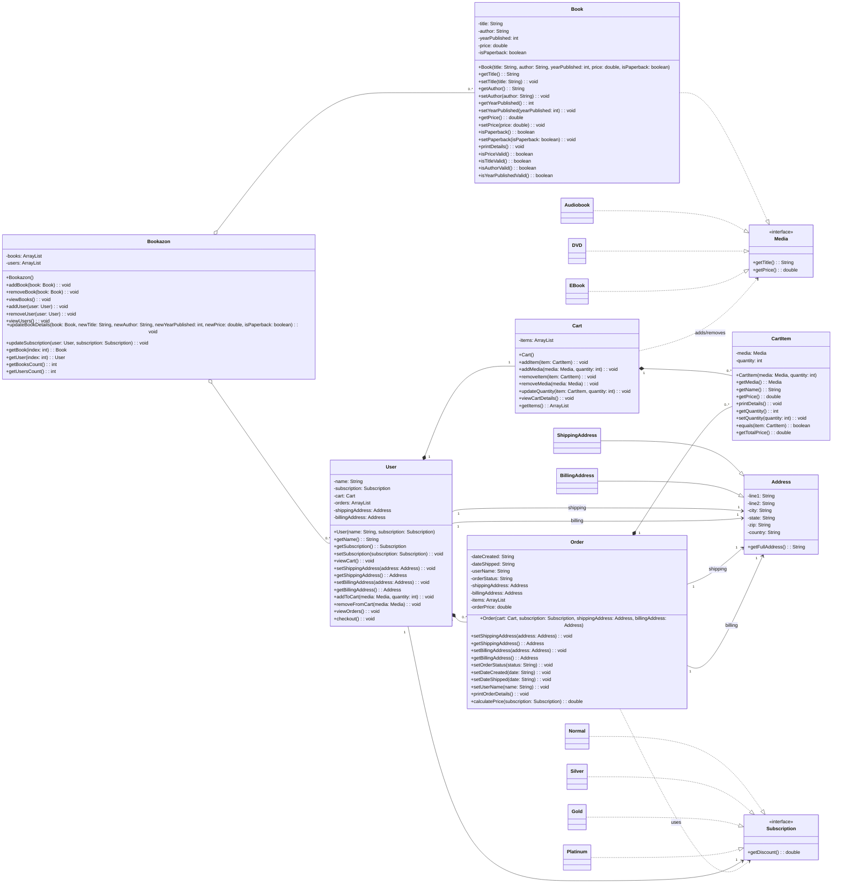

# 📖 Bookazon: Redefining the Way You Buy Books Online 🌐  
## 🍪 Team Snack Overflow 🍕  

Step into **Bookazon**, the next chapter in modern online bookstores - where SOLID design meets smooth shopping!  

Our membership options unlock new experiences: **Normal**, **Silver**, **Gold**, and **Platinum** tiers, with each offering unique perks and savings.  

<div align="center">
  
</div>

---

## 🌈 What We’re Building  

Bookazon began as a humble bookstore, and we’ve reimagined it into a sleek, flexible, and SOLID-aligned codebase. Our focus is simple: **clarity, adaptability, and long-term reliability**.  

Our system now clearly defines each role in the process — from **Book** (the catalog data) and **CartItem** (purchasable line items) to **User** (customer context) and **Order** (pricing and discount logic driven by Subscription strategies).  

🎯 Our Development Vision

- 🧱 Architect a structure rooted in SOLID principles  
- 🧽 Clean up code smells and hidden dependencies  
- 🧩 Strengthen readability and testing culture  
- 🔁 Adopt Agile Scrum for iterative progress  
- 🤜🤛 Collaborate openly with branches, issues, and reviews  

---

## ⚡ What’s New and Improved  

### 🎨 Smarter Design, Smoother Experience  
- Modular membership strategies (Normal, Silver, Gold, Platinum) via a clean **Subscription interface**, making new discount types a breeze to add.  
- The **Order** class easily calculates totals by applying discounts after summing up each **CartItem**.  
- Defensive copying ensures **Order** data stays accurate even when the cart evolves; no accidental overwrites!  
- A refined **Address hierarchy** separates billing and shipping, simplifying the data flow and intent.  

### 📦 Why Not Just Use “Book”?  
**CartItem** made little sense in the original implementation of Bookazon, however, our changes make it so that both classes have a definite purpose now. Now, a **Book** represents the catalog entry (title, author, base price), while **CartItem** represents a *snapshot in time*, a book, its quantity, and price at checkout. Now, even if catalog prices change later, orders remain historically accurate. This approach also made it easier for us to add **audiobooks, DVDs**, etc without rewriting our order logic.  
---

## 🧱 How We Designed It  

To make updates safe and affordable, we leaned on **SOLID** principles — ensuring every piece of code has one clear job and works predictably with others. This can be seen clearly in the UML diagram in the next section.

| Principle | How It Shows Up |
|------------|----------------|
| **S — Single Responsibility** | Each class tackles a distinct purpose; output logic is moving out of domain layers. |
| **O — Open/Closed** | New subscription tiers or product types can be added without altering existing classes. |
| **L — Liskov Substitution** | Subtypes like `ShippingAddress` or `Gold` work seamlessly where their parents are expected. |
| **I — Interface Segregation** | The `Subscription` interface is intentionally lean, easy to extend later and does not force users to use any extra methods. |
| **D — Dependency Inversion** | High-level classes depend on abstractions, not concrete details. |

### 🧠 Examples of SOLID in Action  
- The **Subscription** strategy encapsulates discount logic outside **Order**, keeping pricing rules modular.  
- **Cart** manages its own math, ensuring **User** stays lightweight and orchestrative.  
- By copying cart data into **Order**, we eliminate accidental reference issues and preserve checkout accuracy.  
- **Address subclasses** make data intent explicit — no more guessing what type you’re dealing with.  

---
## 📊 UML Diagram

---
## 🚫 Smells We Eliminated  

- **Data Clumps** — Replaced with a proper **Address** structure.  
- **God Object Syndrome** — The **User** delegates; the **Cart** does the calculations.  
- **Leaky Encapsulation** — Defensive copying and private accessors keep data sealed tight.  
- **Cart Identity Confusion** — Unified logic ensures product matches and quantities merge consistently.  

---


## 🏁 Running Bookazon
1. **Compile all files**
   ```
   javac *.java
   ```
2. **Run the file containing the main method**
   ```
   java Bookazon
   ```
---

## 📉 Sprint Progress  

  
<div align="center">*(This section updates automatically as our sprints progress!)*</div>

---

